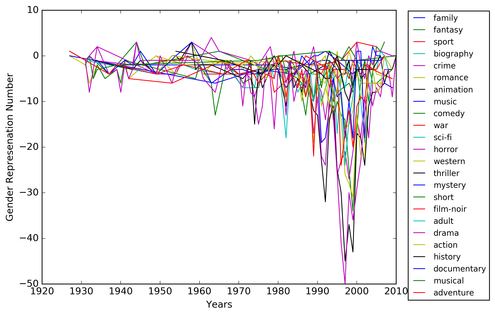
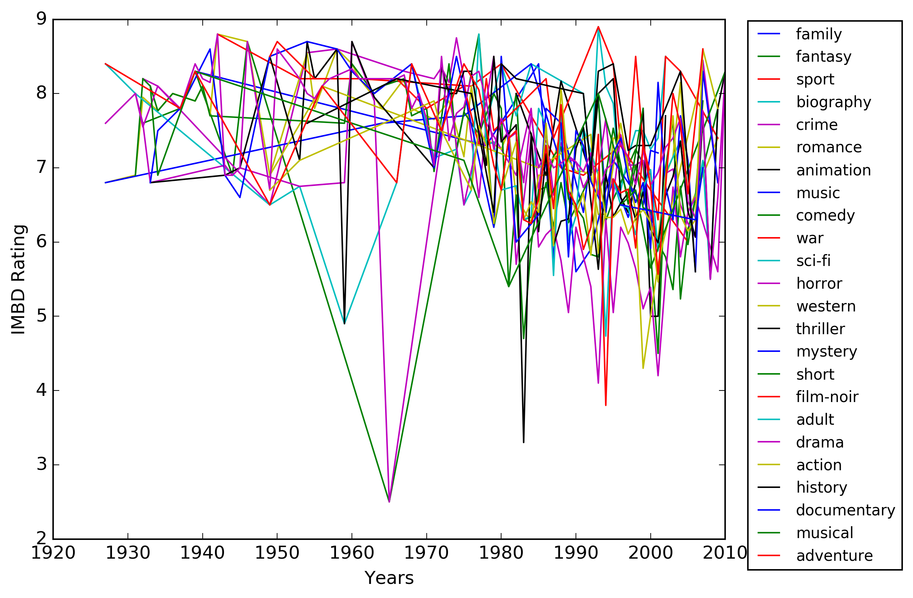
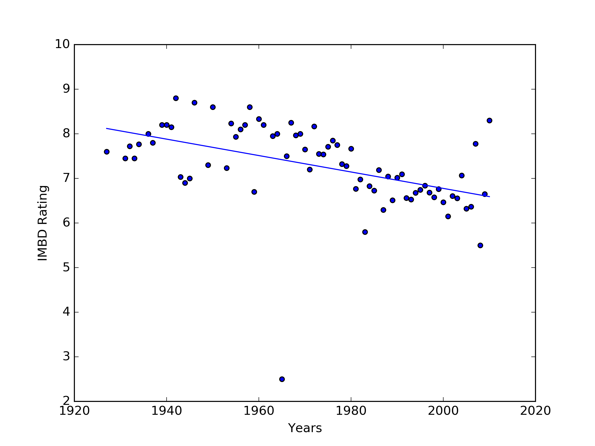

<h1 align="center">Film Trends Across Time</h1>

<h4 align="center">A data analysis project using character metadata and IMDb ratings to discover film trends over the last ~85 years.</h4>

  <a href="#research-questions">Research Questions</a>&nbsp;|
   &nbsp;<a href="#dataset">Dataset</a>&nbsp;|
   &nbsp;<a href="#results">Results</a>&nbsp;|
   &nbsp;<a href="#notes-and-acknowledgements">Notes and Acknowledgements</a>&nbsp;|
   &nbsp;<a href="#license">License</a>

## Research Questions

1. Is there greater gender equality/representation in films today than in films from a couple decades ago?

	__TLDR:__ No, gender representation is about the same as it was a century ago after recently recovering from a massive trend towards over representing men in films across nearly all genres.

2. How have IMDb ratings across all genres changed over time?

	__TLDR:__ Over the past century IMDb ratings have generally decreased by about one point across all genres.

## Dataset

Source: [Cornell Movie Dialogs Corpus](http://www.cs.cornell.edu/~cristian/Cornell_Movie-Dialogs_Corpus.html)

> “A corpus containing a large metadata-rich collection of fictional conversations extracted from raw movie scripts.”

- 220,579 conversational exchanges between 10,292 pairs of movie characters
- 9,035 characters from 617 movies
- 304,713 total utterances
- Movie metadata included:
	- Genres
	- Release year
	- IMDb rating
	- Number of IMDb votes
	- IMDb rating
- Character metadata included:
	- Gender (for 3,774 characters)
	- Position on movie credits (3,321 characters)

## Results

### Gender Representation
The results of these two research questions were incredibly interesting. My first question tackled gender representation in films across the last couple of decades. The short answer to if it has gotten better is no. Depicted below is a graph visualizing my findings for this question:

The x-axis graphed release years of movies starting in the late 1920’s and ending in 2010, while the y-axis depicted “Gender Representation Number” which was the difference of the sum of female and male characters for a given year.

- If the number is zero there was equal representation
- A positive number means _n number_ more women than men
- A negative number means _n number_ more men than women

With that piece of information one can immediately tell that representation of gender in film during the last century has been lacking. Regardless, there are still some noteworthy findings from this analysis.

#### Gender Representation Is About The Same As 100 Years Ago
Compared to gender representation about a century ago, gender representation today is about the same. This trend towards equality is only recently recovering from a massive trend towards over-representing men in films across nearly all genres during the last 2-3 decades. This is a surprising conclusion when we are so conditioned to think about the “antiquated thinking” of generations of the past.

#### Female Representation Maximums in Questionable Genre
Other noteworthy data points to look at are the maximums for male and female representation. The maximum for male representation is 50 more male characters than female characters in the Drama genre during 1997. The maximum for female representation is only 4 more female characters than male characters in the Horror genre during 1963–-a genre with historically questionable ways of representing female characters.

### IMDb Ratings
The second question tackled changes in IMDb ratings over the last couple decades and resulted in the conclusion that ratings across all genres have generally been decreasing during the last century.

The first visualization from this question plots years on the x-axis and IMDb ratings on the y-axis with a colored line representing the different genres this data covers.

Looking for trends from the data as whole was a bit challenging with this graph and is the reason why I chose to make a second graph depicting a line of best fit for the data (graph below). However, like the gender representation results, there are still some interesting outlier data points that can be noted.

#### The Lowest & Highest Rated Genres of the Last Century
The minimum rating is held by Fantasy and Horror, during 1965 with an IMDb rating of 2.5. The highest rating given in this data is an 8.9, during 1993 to the War genre. This was a very surprising data point for multiple reasons. It’s the highest rating during the last century and at a time when ratings across all genres were trending at their lowest ever. Additionally, the fact that this is rating is for the war genre is a surprising result when the Cold War had just ended two years prior and the world was entering a time of relative peace.

This final graph also depicts years on the x-axis and IMDb ratings on the y-axis. Each point on the graph now depicts the average of all rating across all genres for the given year with a line of best fit showing the trend of movie ratings over the last century. A possible reason for this downward trend could be a loss of novelty in films over the years, combined with an increasingly knowledgeable and critical audience of the language of filmmaking.

## Notes and Acknowledgements

_Final project for CSE 160: Data Programming at the University of Washington (Winter 2017)._

## License

[MIT](LICENSE)
